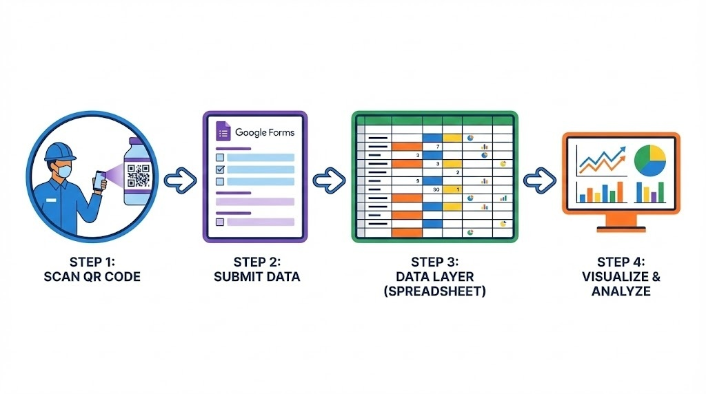
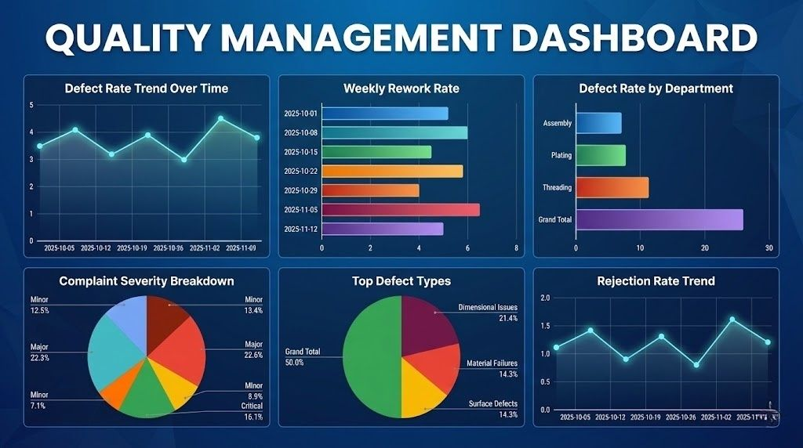

# 🏭 Quality Management System: Digital Transformation for Vaishnav Fasteners

**Role:** Business Analyst & Solution Architect
**Tools:** Google Sheets, Google Forms, Data Studio (Looker), Operations Management
**Context:** 20,000 sq. ft. Manufacturing Unit Transition

## 📌 Executive Summary
This project was designed for **Vaishnav Fasteners**, a company transitioning from traditional manual logging to a system-driven quality approach. The objective was to replace disparate manual reports with a centralized "Single Source of Truth" dashboard to monitor defect rates, rework, and customer complaints in real-time.

## 🚧 The Problem
The factory faced operational bottlenecks due to manual data collection:
* **Data Latency:** Quality logs were physical, leading to delayed decision-making.
* **Lack of Standardization:** Defect categories (Dimensional, Surface) were recorded on an ad-hoc basis.
* **Reactive Approach:** The team struggled to identify root causes effectively.

---

## 🔄 The Solution: "Scan-to-Track" Workflow
I designed a low-code architecture to bridge the physical factory floor with digital management tools. The system ensures **zero-friction data entry** for workers while providing instant analytics for managers.

### How it Works (Step-by-Step):
1.  **Scan (Origination):** Operators scan a QR code pasted at their workstation using a mobile device.
2.  **Submit (Input):** A pre-filled Google Form opens for quick entry of Production Counts & Rejections.
3.  **Data Layer (Processing):** Data is instantly pushed to a Master Google Sheet (Cloud Database) where validation scripts run.
4.  **Visualize (Output):** The dashboard updates in < 5 seconds, alerting managers to anomalies.

---

## 📸 Dashboard Preview
The final output is a live dashboard enabling the "Insight-to-Action" loop.

### Key Metrics Tracked:
* **Defect Rate Trend:** Monitors the overall health of the production line over time.
* **Pareto Analysis (Top Defect Types):** Identifies the 20% of defects causing 80% of waste (e.g., Dimensional Issues).
* **Complaint Severity:** Prioritizes "Critical" feedback for immediate resolution.
* **Weekly Rework Rate:** Tracks performance anomalies by specific production weeks.

---

## 🚀 Impact & Results
* **Real-time Visibility:** Eliminated the lag between production and reporting (from Weekly to Real-Time).
* **Standardization:** Enforced consistent defect categorization across all departments.
* **Scalability:** The system uses low-code tools (Google Ecosystem), allowing for immediate, zero-cost deployment.

---
*Based on the assignment submitted for Vaishnav Fasteners. Full documentation available in the `documents/` folder.*
